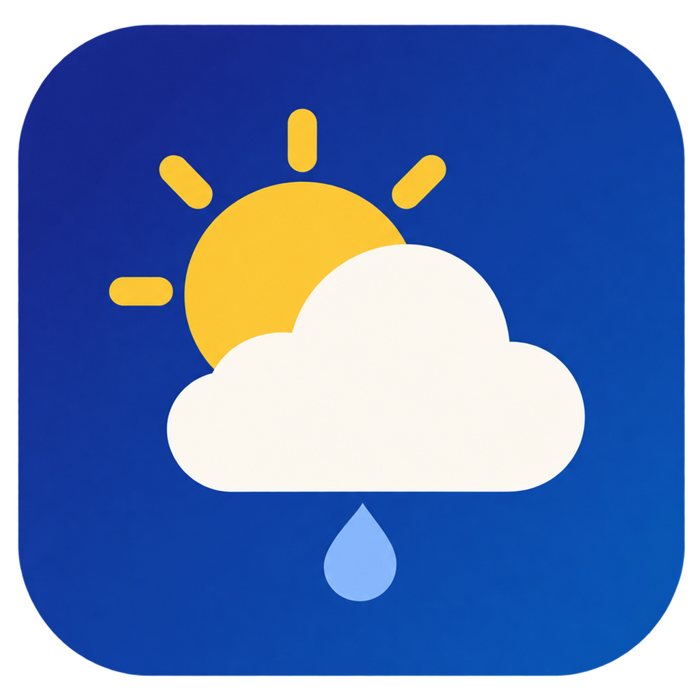
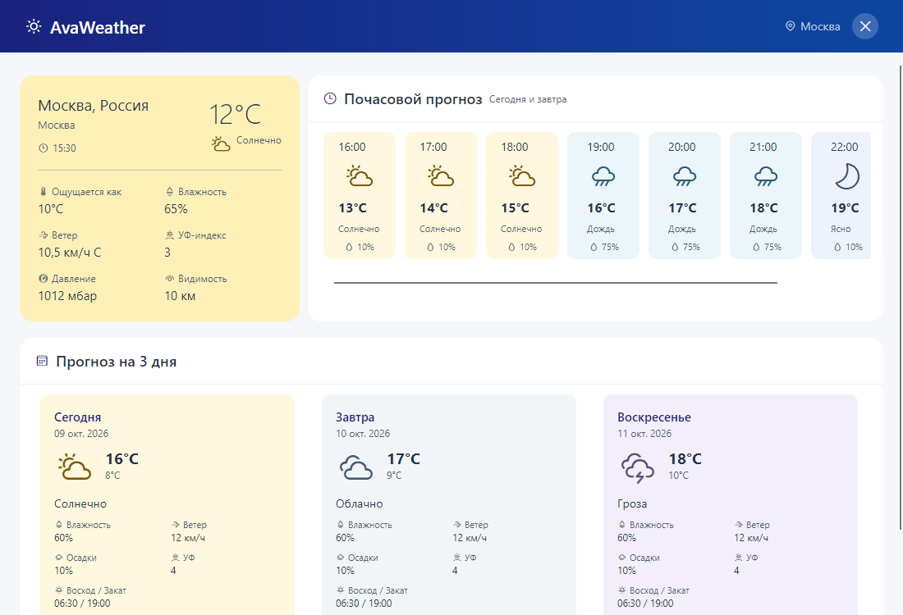

[](https://github.com/gagarinbefree/AvaWeather/actions/workflows/dotnet-tests.yml)
[](https://dotnet.microsoft.com/)
[](https://avaloniaui.net/)
[](https://learn.microsoft.com/dotnet/communitytoolkit/mvvm/)

# AvaWeather



Кроссплатформенное настольное погодное приложение на .NET 9 и Avalonia. Нативное приложение для Windows, Linux и macOS.

**Последняя версия:** <!-- release-version -->v1.0.26<!-- /release-version -->

## Скачать

| Платформа | Автономный файл | Установщик |
|-----------|----------------|------------|
| Windows x64 | [AvaWeather-win-x64.exe](https://github.com/gagarinbefree/AvaWeather/releases/latest/download/AvaWeather-win-x64.exe) | [AvaWeather-setup-win-x64.exe](https://github.com/gagarinbefree/AvaWeather/releases/latest/download/AvaWeather-setup-win-x64.exe) |
| Windows ARM64 | [AvaWeather-win-arm64.exe](https://github.com/gagarinbefree/AvaWeather/releases/latest/download/AvaWeather-win-arm64.exe) | [AvaWeather-setup-win-arm64.exe](https://github.com/gagarinbefree/AvaWeather/releases/latest/download/AvaWeather-setup-win-arm64.exe) |
| Linux x64 | [AvaWeather-linux-x64.tar.gz](https://github.com/gagarinbefree/AvaWeather/releases/latest/download/AvaWeather-linux-x64.tar.gz) | — |
| Linux ARM64 | [AvaWeather-linux-arm64.tar.gz](https://github.com/gagarinbefree/AvaWeather/releases/latest/download/AvaWeather-linux-arm64.tar.gz) | — |
| macOS Intel | [AvaWeather-osx-x64](https://github.com/gagarinbefree/AvaWeather/releases/latest/download/AvaWeather-osx-x64) | [AvaWeather-setup-osx-x64.pkg](https://github.com/gagarinbefree/AvaWeather/releases/latest/download/AvaWeather-setup-osx-x64.pkg) |
| macOS Apple Silicon | [AvaWeather-osx-arm64](https://github.com/gagarinbefree/AvaWeather/releases/latest/download/AvaWeather-osx-arm64) | [AvaWeather-setup-osx-arm64.pkg](https://github.com/gagarinbefree/AvaWeather/releases/latest/download/AvaWeather-setup-osx-arm64.pkg) |

Установщик Windows добавляет приложение в меню «Пуск», при желании создаёт ярлык на рабочем столе и регистрирует удаление в настройках Windows. Пакет macOS устанавливает `AvaWeather.app` с иконкой в `/Applications`. Оба установщика содержат то же автономное приложение, что доступно отдельным файлом. Установщики приложения пока не подписаны доверенными сертификатами; Windows и macOS могут запросить подтверждение запуска.

### Системные виджеты Windows 11 и macOS

| Платформа | Установщик виджета |
|-----------|---------------------|
| Windows 11 x64 | [AvaWeather-widget-setup-win-x64.exe](https://github.com/gagarinbefree/AvaWeather/releases/latest/download/AvaWeather-widget-setup-win-x64.exe) |
| Windows 11 ARM64 | [AvaWeather-widget-setup-win-arm64.exe](https://github.com/gagarinbefree/AvaWeather/releases/latest/download/AvaWeather-widget-setup-win-arm64.exe) |
| macOS Intel | [AvaWeather-widget-osx-x64.zip](https://github.com/gagarinbefree/AvaWeather/releases/latest/download/AvaWeather-widget-osx-x64.zip) |
| macOS Apple Silicon | [AvaWeather-widget-osx-arm64.zip](https://github.com/gagarinbefree/AvaWeather/releases/latest/download/AvaWeather-widget-osx-arm64.zip) |

Виджеты собираются отдельно от автономного приложения: системные панели требуют пакет MSIX в Windows и расширение WidgetKit внутри `.app` в macOS. Linux-пакеты виджетов не выпускаются. Виджет обновляет погоду самостоятельно, когда окно приложения закрыто, выбирает язык по стране, определённой через IP, и использует Open-Meteo с резервным WeatherAPI.

Установщик Windows содержит `.msix` и публичный сертификат подписи внутри одного `.exe`. Он показывает отпечаток сертификата, проверяет целостность вложенных файлов и подпись пакета, затем запрашивает разрешение администратора, чтобы добавить сертификат в **Доверенные лица локального компьютера**, и устанавливает виджет для текущего пользователя. После этого добавьте AvaWeather в панели виджетов Windows. Сам установщик подписан тем же сертификатом для разработки; до первого доверия Windows может показать предупреждение о неизвестном издателе. Отдельные [MSIX x64](https://github.com/gagarinbefree/AvaWeather/releases/latest/download/AvaWeather-widget-win-x64.msix), [MSIX ARM64](https://github.com/gagarinbefree/AvaWeather/releases/latest/download/AvaWeather-widget-win-arm64.msix), [CER x64](https://github.com/gagarinbefree/AvaWeather/releases/latest/download/AvaWeather-widget-win-x64.cer) и [CER ARM64](https://github.com/gagarinbefree/AvaWeather/releases/latest/download/AvaWeather-widget-win-arm64.cer) доступны для ручной установки. Для неё сертификат нужно импортировать в хранилище **Доверенные лица локального компьютера** с правами администратора.

Сертификат для разработки создаётся заново для каждого релиза и остаётся в хранилище после удаления виджета; его можно удалить вручную по показанному отпечатку. Для распространения без такого доверия нужна подпись от доверенного издателя или публикация через Microsoft Store.

На macOS распакуйте `.zip`, перенесите `AvaWeatherWidgetHost.app` в Applications и запустите его один раз. Затем добавьте AvaWeather на рабочий стол или в Центр уведомлений через галерею виджетов. Пакет подписан локальной подписью без Apple Developer ID; macOS может попросить подтвердить первый запуск в настройках безопасности. Для распространения без этого шага понадобятся Apple Developer ID и notarization.

Автономные файлы остаются доступны для всех платформ. Windows сборка — самодостаточный `.exe`; архив Linux содержит один самодостаточный исполняемый файл `AvaWeather`; macOS сборка скачивается непосредственно как самодостаточный исполняемый файл. .NET Runtime устанавливать не нужно. На Linux распакуйте архив и запустите `./AvaWeather`. На macOS для отдельного файла выполните `chmod +x AvaWeather-osx-arm64 && ./AvaWeather-osx-arm64` (для Intel замените `arm64` на `x64`). Установщик macOS добавляет приложение с иконкой в Finder и Dock.

## О проекте

Приложение автоматически определяет приблизительную локацию по IP через GeoJS и показывает погоду для найденного города. Основной источник прогноза — Open-Meteo; если определение города или запрос прогноза не удались, приложение загружает прогноз через WeatherAPI с определением города по IP:

- **Текущая погода** - температура, ощущается как, влажность, ветер, УФ-индекс, давление и видимость.
- **Почасовой прогноз** - оставшиеся часы сегодняшнего дня и следующий день по времени города.
- **Прогноз на 3 дня** - максимальная и минимальная температура, осадки, влажность, ветер и время восхода и заката.

### Особенности

- ✅ MVVM и генераторы свойств и команд CommunityToolkit.Mvvm.
- ✅ Compiled bindings и C# разметка `Avalonia.Markup.Declarative`.
- ✅ View Locator и Dependency Injection.
- ✅ Автоматический выбор русского или английского языка по стране, определённой через IP; перевод подписей, ошибок, дат, единиц измерения и описаний погоды.
- ✅ Перестроение карточек при изменении ширины окна.
- ✅ Обработка сетевой ошибки с кнопкой Retry.
- ✅ Тесты
- ✅ Готовые погодные и интерфейсные иконки Fluent UI без собственных SVG-путей и Unicode-пиктограмм.
- ✅ Собственная иконка приложения для окна, Windows `.exe` и Dock на macOS.
- ✅ Мягкие цвета карточек и иконок меняются по погоде каждого периода: солнце, облака, дождь, снег, туман, гроза и ночь.

## Технологии

| Технология | Версия |
|------------|--------|
| .NET | 9.0 |
| Avalonia | 12.1.3 |
| Avalonia.Markup.Declarative | 12.1.1 |
| CommunityToolkit.Mvvm | 8.4.2 |
| FluentIcons.Avalonia | 2.1.343 |
| MediatR | 14.2.0 |
| AutoMapper | 16.2.0 |

## Язык интерфейса

После определения страны приложение включает русский язык для России, Украины, Беларуси, Казахстана, Кыргызстана, Узбекистана, Таджикистана, Туркменистана, Молдовы, Армении, Азербайджана, Грузии, Эстонии, Латвии и Литвы. Для остальных стран и при недоступной геолокации используется английский. Выбор не зависит от языка операционной системы и не требует ручной настройки.

Подписи интерфейса, сообщения ошибок и описания погоды хранятся в `Weather.Localization/*.resx`; C# получает их через `StringLocalizer` по имени. Для macOS сборка экспортирует те же переводы в `.strings` через `tools/export_swift_localization.py`. Соответствие кодов погоды и готовых иконок FluentIcons хранится в `AvaWeather/Assets/weather-conditions.json`. Все цвета интерфейса и погодных карточек находятся в `AvaWeather/Assets/Themes/default.json`; `ThemeColorService` возвращает цвет по имени. Этот же ресурс применяется в виджете macOS. Open-Meteo возвращает числовые коды погоды; приложение переводит их описания на русский или английский. При резервной загрузке WeatherAPI возвращает описания погодных условий на выбранном языке. Для русского интерфейса приложение получает русские названия города и региона через геокодирование Open-Meteo, сверяя результат с координатами геолокации. Если точное написание не найдено, приложение повторяет поиск по началу названия и выбирает ближайший к полученным координатам город. Если сервис названий недоступен, прогноз продолжает работать с исходным названием.

Данные о погоде: [Open-Meteo](https://open-meteo.com/en/docs) ([CC BY 4.0](https://creativecommons.org/licenses/by/4.0/)) и [WeatherAPI](https://www.weatherapi.com/). Геолокация: [GeoJS](https://www.geojs.io/docs/v1/endpoints/geo/); названия мест основаны на [GeoNames](https://www.geonames.org/) ([CC BY 4.0](https://creativecommons.org/licenses/by/4.0/)). Бесплатный API Open-Meteo работает без ключа при некоммерческом использовании. Доступность погодного API Open-Meteo зависит от сети; при проверке с одного сервера в России соединение завершилось по тайм-ауту, поэтому сохранён резервный WeatherAPI.

## Установка и запуск

Требуется [.NET 9 SDK](https://dotnet.microsoft.com/download/dotnet/9.0). Для резервного источника нужен ключ [WeatherAPI](https://www.weatherapi.com/). На Windows, macOS или Linux:

1. Для работы резервного источника скопируйте `AvaWeather/appsettings.example.json` в `AvaWeather/appsettings.json` и укажите `WeatherApi.ApiKey` либо установите переменную окружения `WEATHER_API_KEY`. Основной Open-Meteo ключа не требует.
2. Запустите приложение:

```sh
dotnet run --project AvaWeather/AvaWeather.csproj
```

Локальный `appsettings.json` исключён из Git и не входит в публикуемый исполняемый файл. Значение `WeatherApi.DefaultLocation` по умолчанию — `auto:ip`; оно используется только резервным WeatherAPI. Адрес API и число дней резервного прогноза также настраиваются в этом файле. Для готового релиза ключ WeatherAPI встроен при сборке; при необходимости его можно переопределить переменной окружения `WEATHER_API_KEY`. При переключении источника определение города по IP может отличаться между GeoJS и WeatherAPI.

## Тесты

```sh
dotnet test AvaWeather.sln
```

GitHub Actions запускает тесты при каждом push и pull request в `master` или `main`, а также сохраняет TRX-отчёт. После успешных тестов основной ветки он собирает шесть автономных файлов, четыре установщика приложения и четыре пакета виджетов, создаёт GitHub Release, увеличивает версию `1.0.N` и обновляет её в README. Ссылки выше всегда ведут к последнему релизу. Установщик Windows проверяется пробной установкой, сравнением исполняемого файла и удалением; содержимое пакета macOS сравнивается с опубликованным файлом. Тесты проверяют загрузку, повтор после ошибки, защиту от параллельных запросов, фильтрацию часов по времени города, модель и содержимое виджета и отрисовку карточек в широком и узком окне. Для сохранения снимков headless-интерфейса задайте `AVAWEATHER_SCREENSHOT` и `AVAWEATHER_NARROW_SCREENSHOT` с путями к PNG.

Для публикации в настройках репозитория GitHub → **Settings → Secrets and variables → Actions** нужен секрет `WEATHER_API_KEY`. Сборка шифрует ключ AES-GCM и встраивает зашифрованные байты в приложение. Ключ расшифровки тоже находится в файле, так как приложение работает автономно; это скрывает ключ от простого поиска строк, но не защищает его от извлечения. Для настоящей защиты ключ должен оставаться на сервере-посреднике.

## Устройство

- `Domain`, `Application`, `Infrastructure` - логика модели, запросов резервного WeatherAPI и преобразования данных.
- `AvaWeather/Services` - запросы GeoJS и Open-Meteo, перевод кодов погоды и переключение на WeatherAPI при ошибке.
- `AvaWeather/ViewModels` - MVVM-модель экрана на генераторах CommunityToolkit.Mvvm.
- `AvaWeather/Views` - интерфейс Avalonia на C# и `Avalonia.Markup.Declarative`; связи с данными созданы через `CompiledBinding`.
- `ViewLocator` - явное соответствие модели экрана и представления, создаваемого контейнером DI.

Иконки взяты из [FluentIcons.Avalonia](https://github.com/davidxuang/FluentIcons) и набора [Fluent UI System Icons](https://github.com/microsoft/fluentui-system-icons) под лицензией MIT. Условия погоды отображаются иконками пакета независимо от доступности сети.

Для собственной автономной сборки используйте `dotnet publish AvaWeather/AvaWeather.csproj -c Release -r linux-x64 --self-contained true -p:PublishSingleFile=true -p:IncludeNativeLibrariesForSelfExtract=true` (или другой RID из таблицы). Без секрета сборки Open-Meteo работает, а для резервного WeatherAPI укажите свой ключ через `WEATHER_API_KEY` либо локальный `appsettings.json`.


