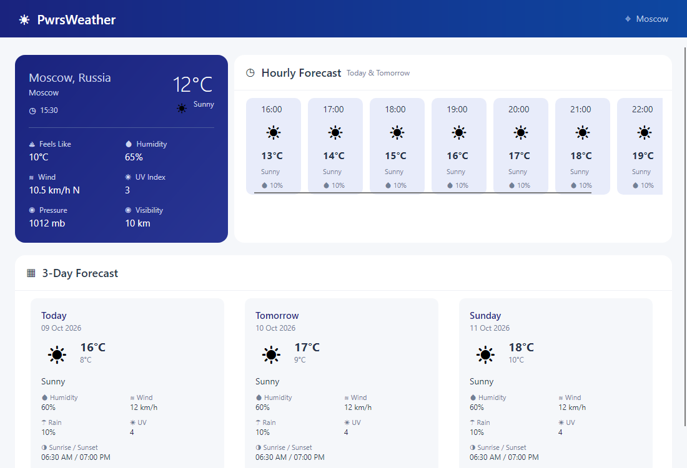

[](https://github.com/gagarinbefree/AvaWeather/actions/workflows/dotnet-tests.yml)
[](https://dotnet.microsoft.com/)
[](https://avaloniaui.net/)
[](https://learn.microsoft.com/dotnet/communitytoolkit/mvvm/)

# AvaWeather

Кроссплатформенное настольное погодное приложение на .NET 9 и Avalonia. Интерфейс переносит оформление [PwrsWeather](https://github.com/gagarinbefree/PwrsWeather) из Blazor в нативное приложение для Windows, Linux и macOS.

## О проекте

Приложение показывает погоду для Москвы:

- **Текущая погода** — температура, ощущается как, влажность, ветер, УФ-индекс, давление и видимость.
- **Почасовой прогноз** — оставшиеся часы сегодняшнего дня и следующий день по времени города.
- **Прогноз на 3 дня** — максимальная и минимальная температура, осадки, влажность, ветер и время восхода и заката.

### Особенности

- ✅ MVVM и генераторы свойств и команд CommunityToolkit.Mvvm.
- ✅ Compiled bindings и C#-разметка `Avalonia.Markup.Declarative`.
- ✅ View Locator и Dependency Injection.
- ✅ Перестроение карточек при изменении ширины окна.
- ✅ Обработка сетевой ошибки с кнопкой Retry.
- ✅ Тесты логики и headless-проверка интерфейса.

## Технологии

| Технология | Версия |
|------------|--------|
| .NET | 9.0 |
| Avalonia | 12.1.3 |
| Avalonia.Markup.Declarative | 12.1.1 |
| CommunityToolkit.Mvvm | 8.4.2 |
| MediatR | 14.2.0 |
| AutoMapper | 16.2.0 |

## Установка и запуск

Требуется [.NET 9 SDK](https://dotnet.microsoft.com/download/dotnet/9.0) и ключ [WeatherAPI](https://www.weatherapi.com/). На Windows, macOS или Linux:

1. Скопируйте `AvaWeather/appsettings.example.json` в `AvaWeather/appsettings.json` и укажите `WeatherApi.ApiKey` либо установите переменную окружения `WEATHER_API_KEY`.
2. Запустите приложение:

```sh
dotnet run --project AvaWeather/AvaWeather.csproj
```

Локальный `appsettings.json` исключён из Git. Адрес API, координаты и число дней можно изменить в этом файле.

## Тесты

```sh
dotnet test AvaWeather.sln
```

GitHub Actions запускает Release-сборку и тесты при каждом push и pull request в `master` или `main`, а также сохраняет TRX-отчёт. Тесты проверяют загрузку, повтор после ошибки, защиту от параллельных запросов, фильтрацию часов по времени города и отрисовку карточек в широком и узком окне. Для сохранения снимков headless-интерфейса задайте `AVAWEATHER_SCREENSHOT` и `AVAWEATHER_NARROW_SCREENSHOT` с путями к PNG.

## Устройство

- `Domain`, `Application`, `Infrastructure` — перенесённая логика модели, запросов WeatherAPI и преобразования данных.
- `AvaWeather/ViewModels` — MVVM-модель экрана на генераторах CommunityToolkit.Mvvm.
- `AvaWeather/Views` — интерфейс Avalonia на C# и `Avalonia.Markup.Declarative`; связи с данными созданы через `CompiledBinding`.
- `ViewLocator` — явное соответствие модели экрана и представления, создаваемого контейнером DI.

Для сборки под конкретную платформу используйте `dotnet publish AvaWeather/AvaWeather.csproj -c Release -r linux-x64 --self-contained false` (или `win-x64`, `osx-x64`, `osx-arm64`). На целевой машине нужен .NET 9 Runtime.


